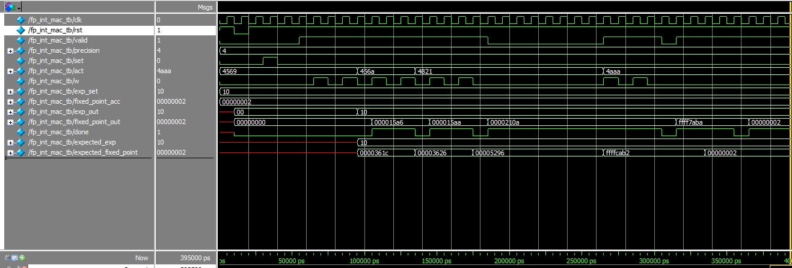

# Posit - Index-based computation of real-number multiplication

## Team Name: 
Posit Team

## Team Members:
- Melika Morsali (qfc2zn)
- Hasantha Ekanayake (uyq6nu)

## 1. Project Overveiw:

#### Project Title: Posit - Index-based computation of real-number multiplication
#### Repository URL: [GitHub Repository Link](https://github.com/hplp/2025-fpga-design-projects-posit-team)

## Project Description:
This project is to develop a custom intellectual property (IP) core for performing Multiply operations where the activation inputs are in 16-bit IEEE floating-
point format (FP16), and the weights are in 4-bit posit (Posit4) format. This IP will be
developed on the PYNQ-Z1 FPGA board using Verilog RTL. The goal is to combine the advantages of industry-standard FP16 activations with
the low-precision posit representation for weights, thereby reducing resource usage while
maintaining reasonable accuracy for real-number Multiply operations. This IP aims to support
computational tasks common in machine learning and high-performance computing.

## 2. Objectives:
- ### Objective 1 - Design a Custom Multiply Unit Using Mixed formats:
  
	•	Develop a Multiply IP core that accepts 16-bit IEEE floating-point (FP16) activations and 4-bit posit (Posit4) weights.

	•	This mixed-format design aims to combine FP16’s compatibility with the memory efficiency of Posit4.

- ### Objective 2 - Implement and Integrate on FPGA:
	•	Build the design using Verilog and implement it on a PYNQ-Z1 FPGA.

	•	Integrate the Multiply unit as a custom IP with AXI interfaces for real-world deployment.

- ### Objective 3 - 	Benchmark and Compare Performance:

  	•	Integrate our multiply module with a simple accumulator to perform the MAC operation.
  
	•	Evaluate the MAC unit against a baseline FP16-Int4 MAC in terms of:
		Resource usage (LUTs, FFs).
  

## 3. Technology Stack:
- PYNQ-Z1 FPGA board
- Vivado and Vitis toolchains
- Verilog RTL

## 4. Expected Outcomes:
1.	A functional custom Multiply IP core that uses FP16-Posit4 computation, synthesized and deployed on the PYNQ-Z1 FPGA board.
2.	Improved hardware resource over traditional FP16-Int4 MAC units, due to the use of compact 4-bit Posit weights.
3.	Verified simulation and hardware testing results showing correctness, resource utilization, and accuracy trade-offs—potentially suitable for edge AI applications.

## 5. Methos:

- Implement FP-Posit Multiplication Module 
- Integrate the multiplier and accumulator modules
- FP-Int as baseline MAC 
- Custom IP Creation for FP-Posit Multiplication Module with PYNQ-Z1 FPGA board
- Benchmarking and Comparing 

## 6. Posit Format

Posit is a **type-3 universal number (unum)** format introduced as a potential replacement for the IEEE-754 floating-point standard. It provides better accuracy, dynamic range, and efficiency — especially at low bit widths — by using a compact and flexible representation of real numbers.

### Key Features of Posit:
- **Single NaR (Not a Real)** value instead of separate NaN/±∞.
- **Tapered precision**: higher precision near 1.0, less near extremes.
- **Encoding components**: sign bit, variable-length *regime*, optional exponent, and fraction.
- **Efficient at low bit-widths**, making it ideal for deep learning inference at the edge.

---

### ⚙️ Posit(4,0) Format Breakdown:

- Total width: 4 bits
- **Bit 0**: Sign
- **Regime**: Unary-encoded scale (dominant bits after sign)
- **Exponent**: None in Posit(4,0) (es = 0)
- **Fraction**: Remaining bits (if any)

> Posit(4,0) supports 16 unique values with higher density near ±1.

---

### 📊 Comparison: Posit vs IEEE-754 (Low Bit Widths)

Unlike IEEE-754 floats, Posit offers:
- No subnormal or reserved bit patterns
- Balanced value distribution
- Better coverage around commonly used values

  

> *Figure: Value distribution comparison between Posit(4,0) and IEEE-754 Float(4-bit).*

---

### ✅ Why Posit(4,0) for Neural Network Weights?

- Ultra-compact (4 bits)
- High precision near 1.0 — where most weight values lie
- Better accuracy vs. Int4 and Float8 at similar cost

For more details, refer to the original article:  
👉 [SIGARCH: Posit - A Potential Replacement for IEEE-754](https://www.sigarch.org/posit-a-potential-replacement-for-ieee-754/)

## 7. Implementiing FP16-POSIT4 Multipiction and MAC operations

## 7. Results:

### 7.1 Implementation and Verification -  FP-Posit MAC
- FP-Posit Multiplication Testbench Result:
  

  

- FP-Posit Accumulator Testbench Result:

  

  

- FP-Posit MAC Testbench Result:

    

  

### 7.2 Implementation and Verification - FP-Int MAC
- FP-Int Multiplication Module as baseline Testbench Result:

  

- FP-Int Accumulator as baseline Testbench Result: 

  

- FP-Int as baseline MAC Testbench Result:

  

  
## 8. Custom IP Creation with Zynq for both FP-Posit MAC and FP-Int MAC 

### 8.1 FP-Posit MAC
Netlist Diagram

  

Resource Utilization

| LUT | FF |
| -------- | -------- |
| 460 | 695 |

### 8.2 FP-Int MAC

Netlist Diagram
<!-- scale to 50% of container width -->

  

Resource Utilization

| LUT | FF |
| -------- | -------- |
| 658 | 792 |

As it is shown above and expected, FP-Posite Mac utilizes less hardware than FP-Int.

## 8. Key Takeaways

## 9. Chalneges
We are currently facing challenges testing our IP using Vitis with C code. Since the Posit input is sent serially with each clock cycle, we've realized that we need to create a custom IP with AXI Stream instead of AXI Lite. However, the issue is that AXI Stream has only four registers, while our code requires eight registers. We are now working on modifying the code to send the Posit input in parallel or exploring how to use AXI Stream with this code.

## 10. Conclusion

## References
