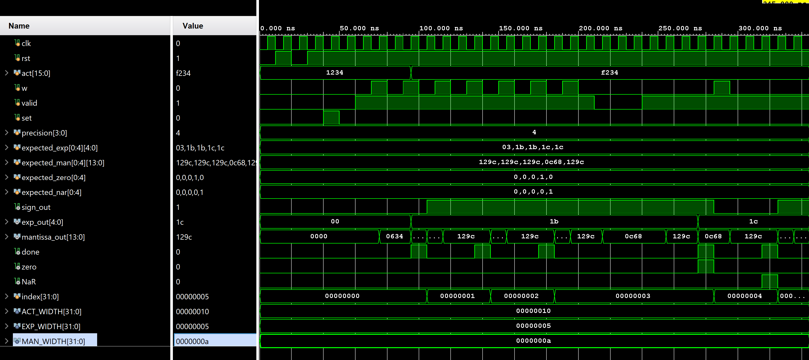
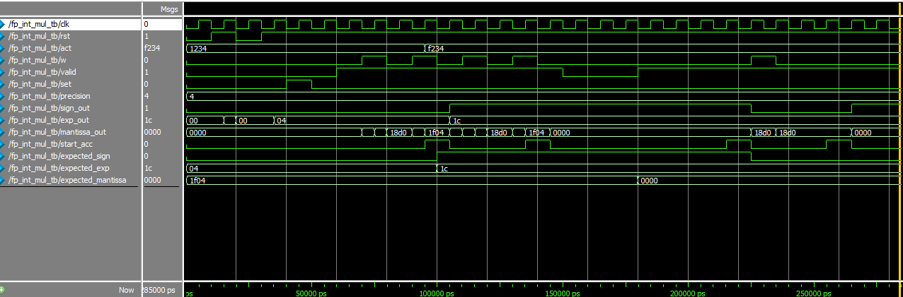
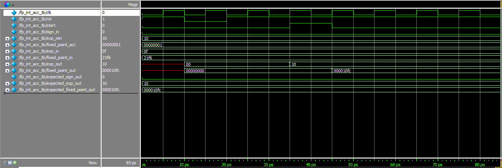
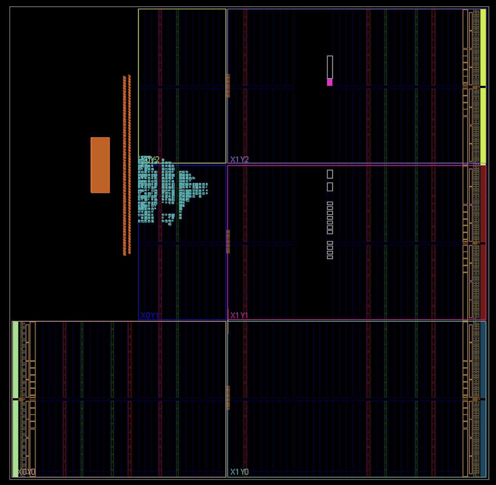

# FPGA Project - Phase 1

## Implementation and Verification -  FP-Posit MAC

- FP-Posit Multiplication Module
  

  

- FP-Posit Accumulator

  

  

- FP-Posit MAC

    

  

## Implementation and Verification - FP-Int MAC
- FP-Int Multiplication Module as baseline

  

- FP-Int Accumulator as baseline

  

- FP-Int as baseline MAC

  

  
## Custom IP Creation with Zynq for both FP-Posit MAC and FP-Int MAC 

#### - FP-Posit MAC

#### - FP-Int MAC

Netlist Diagram
<!-- scale to 50% of container width -->

  

Resource Utilization

| LUT | FF |
| -------- | -------- |
| 658 | 792 |

